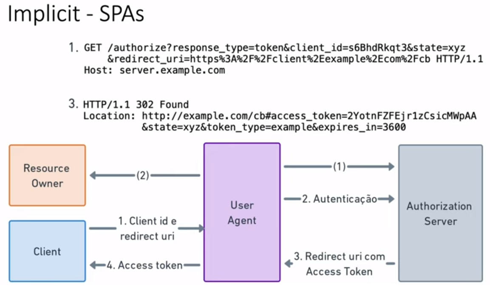

# OAuth 2.0 e OpenID: Uma Introdução

## Visão Geral

O OAuth 2.0 é um protocolo de autorização amplamente usado para conceder acesso a recursos protegidos em nome de um usuário. Ele é amplamente utilizado em aplicativos da web e APIs para permitir a autenticação (Quem é você?) e autorização (O que você tem perrmissão de fazer?) seguras.

Este documento fornece uma introdução ao OAuth 2.0 e explica seus principais conceitos e fluxos.

## Como Funciona o OAuth 2.0

O OAuth 2.0 permite que um aplicativo obtenha acesso a recursos protegidos em nome de um usuário sem revelar as credenciais de login do usuário. Em vez disso, ele funciona com base em tokens de acesso.

Os principais componentes do OAuth 2.0 incluem:

1. **Cliente:** O aplicativo que deseja acessar os recursos protegidos em nome do usuário.

2. **Servidor de Autorização:** Responsável por autenticar o usuário e conceder tokens de acesso.

3. **Proprietário dos Recursos:** O usuário que possui os recursos protegidos.

4. **Servidor de Recursos:** O servidor que hospeda os recursos protegidos e verifica os tokens de acesso.

5. **Token de Acesso**: Um token que permite ao cliente acessar um recurso protegido.

## Fluxos de Autorização

O OAuth 2.0 define vários fluxos de autorização, cada um adequado para diferentes cenários de uso. Os fluxos mais comuns incluem:

- **Fluxo de Autorização do Código:** Usado por aplicativos da web para obter um token de acesso após a autorização do usuário.

- **Fluxo Implícito:** Usado em aplicativos da web e clientes nativos para obter tokens de acesso diretamente do servidor de autorização.

- **Fluxo de Credenciais do Proprietário da Senha:** Usado quando o cliente conhece as credenciais do usuário e deseja obter um token de acesso.

- **Fluxo de Cliente:** Usado por aplicativos confiáveis ​​que não enviam credenciais do usuário ao servidor de autorização.

## Alternativas para Implementação ou Delegação de OAuth 2.0

OAuth 2.0 é um protocolo flexível para autenticação e autorização que oferece diversas alternativas para implementação ou delegação. As escolhas podem depender das necessidades do projeto, recursos disponíveis e requisitos de segurança.

### 1. Implementação Interna

- **Autenticação e Autorização Internas:** Você pode criar seu próprio servidor de autorização OAuth 2.0. Isso oferece controle total sobre o processo, mas requer desenvolvimento e manutenção contínuos.

### 2. Usar um Serviço de Terceiros

- **Serviços de Autenticação Social:** Empresas como Google, Facebook e GitHub oferecem autenticação social, permitindo que os usuários usem suas contas em plataformas conhecidas.

- **Provedores de Identidade (IdPs):** Serviços como Okta, Auth0 e Keycloak oferecem soluções completas de autenticação e autorização, incluindo suporte ao OAuth 2.0.

### 3. Combinação de Implementações

- **Abordagem Híbrida:** Combine autenticação social com gerenciamento interno de autorizações, permitindo login fácil e controle de permissões.

### 4. Bibliotecas e Frameworks

- **Frameworks OAuth 2.0:** Use bibliotecas e plugins disponíveis em frameworks de desenvolvimento web e linguagens de programação para acelerar a implementação.

Lembre-se de avaliar a segurança ao escolher uma alternativa e documentar o processo para facilitar a manutenção futura.

## Segurança

OAuth 2.0 oferece recursos de segurança robustos, incluindo proteção contra ataques de redirecionamento aberto, tokens de acesso de curta duração e revogação de tokens. No entanto, é importante implementar o OAuth 2.0 corretamente para garantir a segurança.

## Papéis do OAuth

O OAuth envolve vários papéis principais que desempenham funções distintas durante o processo de autorização.

  

### Resource Owner (Dono do Recurso)

O Resource Owner é o usuário final que possui os recursos protegidos. Esses recursos podem incluir dados pessoais, como fotos, documentos ou informações de perfil. O Resource Owner decide com quem deseja compartilhar esses recursos e concede autorizações.

### Client (Cliente)

O Cliente é um aplicativo que solicita acesso aos recursos protegidos em nome do usuário Resource Owner. Esse cliente pode ser um aplicativo da web, um aplicativo móvel ou qualquer aplicativo de terceiros que deseja acessar os dados do usuário.

### Authorization Server (Servidor de Autorização)

O Authorization Server é responsável por autenticar o Resource Owner e conceder tokens de acesso ao Cliente. Ele verifica as credenciais do usuário e determina se o Cliente está autorizado a acessar os recursos solicitados. O servidor de autorização emite tokens de acesso para permitir o acesso do Cliente aos recursos protegidos.

### Resource Server (Servidor de Recursos)

O Resource Server é onde os recursos protegidos estão armazenados. Ele verifica os tokens de acesso emitidos pelo Authorization Server e concede ou nega o acesso ao Cliente com base nessas informações. O Resource Server protege os recursos e garante que apenas Clientes autorizados possam acessá-los.

### Tokens

Durante o processo de autorização, tokens são usados para representar a concessão de acesso a recursos. Existem dois tipos principais de tokens no OAuth:

- **Token de Autorização (Authorization Code)**: Um token usado pelo Cliente para obter um Token de Acesso.
- **Token de Acesso (Access Token)**: Um token usado pelo Cliente para acessar recursos protegidos no Resource Server.

### Fluxo de Autorização

O OAuth define vários fluxos de autorização, cada um com seu próprio cenário de uso. Os fluxos incluem Fluxo de Autorização Implícita, Fluxo de Autorização de Código de Autorização, Fluxo de Senha de Proprietário de Recurso e outros.

No geral, o OAuth permite que os Clientes obtenham acesso aos recursos protegidos em nome do Resource Owner, mantendo a segurança e o controle do usuário sobre seus dados.

## Etapas do Processo de Autorização no OAuth

O processo de autorização envolve vários passos e papéis distintos. Abaixo estão as etapas típicas do processo de autorização no OAuth:

### 1. Registro do Cliente (Client Registration)

O Cliente (aplicativo) deve se registrar no Authorization Server (Servidor de Autorização) antes de poder solicitar acesso aos recursos. Durante o registro, o Cliente recebe um ID de Cliente e uma Chave Secreta.

### 2. Solicitação de Autorização (Authorization Request)

O Cliente solicita autorização para acessar os recursos protegidos em nome do usuário (Resource Owner). Isso é feito por meio de uma solicitação de autorização ao Authorization Server.

### 3. Redirecionamento para o Authorization Server

O Resource Owner é redirecionado para o Authorization Server, onde ele fornece suas credenciais e aprova a solicitação de autorização do Cliente.

### 4. Emissão do Token de Autorização (Authorization Token)

Após a aprovação da solicitação de autorização pelo Resource Owner, o Authorization Server emite um Token de Autorização (Authorization Code) para o Cliente. Este token é uma prova de que o Resource Owner deu sua autorização.

### 5. Troca do Token de Autorização por um Token de Acesso (Access Token)

O Cliente troca o Token de Autorização por um Token de Acesso (Access Token) no Authorization Server. O Access Token é usado para acessar os recursos protegidos no Resource Server.

### 6. Acesso aos Recursos Protegidos

O Cliente usa o Access Token para acessar os recursos protegidos no Resource Server. O Resource Server valida o token antes de conceder ou negar o acesso.

### 7. Renovação de Token (Token Renewal)

Os Tokens de Acesso têm um tempo de vida limitado. O Cliente pode solicitar uma renovação do Token de Acesso ao Authorization Server, desde que a autorização do Resource Owner ainda seja válida.

### 8. Revogação de Token (Token Revocation)

O Resource Owner pode revogar a autorização concedida a qualquer momento. Isso invalidará os Tokens de Acesso emitidos e impedirá o acesso aos recursos protegidos.

Estas são as etapas gerais do processo de autorização no OAuth, envolvendo papéis como o Cliente, o Resource Owner, o Authorization Server e o Resource Server. O OAuth permite que os Clientes acessem recursos protegidos com a devida autorização, mantendo a segurança e o controle do usuário sobre seus dados.

  

## OpenID: Autenticação Federada Simplificada

O OpenID é um protocolo de autenticação federada que permite que os usuários autentiquem-se em aplicativos e serviços usando identidades de terceiros. Focado na identidade do usuário (Id Token). Ele simplifica o processo de autenticação, tornando-o mais conveniente e seguro.  

OIDC é uma extensão do OAuth 2.0 que adiciona recursos de autenticação à estrutura. Ele fornece informações detalhadas sobre a identidade do usuário e é amplamente usado para autenticação única (SSO). Ao usar OIDC com OAuth 2.0, você pode solicitar um token de ID adicional que contém informações de identidade do usuário autenticado.

  

Vamos explorar as principais características do OpenID:

### 1. Autenticação Federada

- **Identidade de Terceiros:** Os usuários podem usar identidades de terceiros, como contas do Google, Facebook ou GitHub, para acessar um aplicativo.

- **Eliminação de Senhas:** O OpenID elimina a necessidade de criar e lembrar senhas para cada serviço, o que reduz o risco de senhas fracas ou reutilizadas.

### 2. Single Sign-On (SSO)

- **Login Único:** O OpenID permite o SSO, onde os usuários fazem login em um único lugar e ganham acesso a vários serviços sem precisar inserir suas credenciais novamente.

- **Experiência do Usuário:** SSO proporciona uma experiência de usuário mais fluida, economizando tempo e evitando a frustração de várias autenticações.

### 3. Segurança Aprimorada

- **Autenticação Forte:** O OpenID permite que os provedores de identidade usem autenticação de múltiplos fatores (MFA) para maior segurança.

- **Autorização Granular:** Os aplicativos podem solicitar apenas as permissões necessárias, reduzindo os riscos de segurança.

### 4. Protocolo Aberto

- **Padrões Abertos:** O OpenID é baseado em padrões abertos, tornando-o interoperável entre diferentes provedores de identidade e aplicativos.

- **Implementação Flexível:** Desenvolvedores podem escolher entre várias implementações e bibliotecas que suportam o OpenID.

### 5. Privacidade

- **Controle do Usuário:** Os usuários têm controle sobre quais informações compartilhar com os aplicativos, protegendo sua privacidade.

- **Consentimento Informado:** Os aplicativos devem solicitar o consentimento do usuário antes de acessar suas informações.

O OpenID simplifica a autenticação e oferece uma experiência de usuário aprimorada, ao mesmo tempo em que fortalece a segurança e a privacidade. É uma opção valiosa para aplicativos e serviços que desejam melhorar a autenticação e a autorização de seus usuários.

## OAuth 2.0 e OpenID Connect (OIDC)

### Vantagens da Combinação

Ao combinar OAuth 2.0 e OIDC, você obtém:

1. **Autenticação Forte**: OIDC verifica a identidade do usuário, fornecendo informações detalhadas sobre o usuário autenticado.
2. **Autorização Flexível**: OAuth 2.0 permite conceder permissões granulares para recursos protegidos.
3. **Gerenciamento de Identidade Simplificado**: OIDC simplifica o gerenciamento de identidade e autenticação única.
4. **Ampla Aceitação**: Ambos os protocolos são amplamente aceitos e suportados.

## Tipos de Tokens em Autenticação e Autorização

Os tokens desempenham um papel crucial em sistemas de autenticação e autorização. Eles fornecem uma maneira segura de identificar e autorizar usuários em aplicativos e serviços da web. Dois tipos populares de tokens são **JWT (JSON Web Tokens)** e **Tokens Opacos**. Vamos explorar suas características e uso.

### JSON Web Tokens (JWT)

**JSON Web Tokens (JWT)** são uma forma compacta e autossuficiente de representar informações entre duas partes. Eles são geralmente usados para transmitir afirmações entre um provedor de identidade (IdP) e um cliente ou aplicativo.

  

#### Características do JWT

- **Estrutura JSON**: Um JWT é um token codificado em formato JSON, que contém informações específicas sobre um usuário ou entidade.

- **Assinatura Digital**: Os JWTs podem ser assinados digitalmente para verificar sua autenticidade. Isso garante que o token não tenha sido alterado durante a transmissão.

- **Carga Útil Personalizada**: A carga útil de um JWT pode conter informações personalizadas, como ID do usuário, permissões, tempo de expiração e muito mais.

- **Decodificação Facilitada**: Os JWTs podem ser facilmente decodificados pelo cliente para obter informações sem a necessidade de fazer uma consulta adicional ao servidor.

#### Uso Comum do JWT

- **Autenticação Única (SSO)**: Os JWTs são frequentemente usados para implementar a funcionalidade de SSO, onde um usuário pode fazer login uma vez em vários serviços ou aplicativos.

- **Autorização**: Os JWTs podem conter informações sobre as permissões de um usuário, permitindo que os aplicativos concedam ou neguem acesso com base no conteúdo do token.

### Tokens Opacos

**Tokens Opacos** são tokens que não contêm informações diretamente legíveis. Em vez disso, eles são usados como identificadores exclusivos para recuperar informações do servidor de autorização.

#### Características dos Tokens Opacos

- **Identificadores**: Os tokens opacos são geralmente identificadores aleatórios ou códigos que não têm significado em si mesmos.

- **Consultas ao Servidor**: Em vez de conter informações diretamente, os tokens opacos são usados para fazer consultas ao servidor de autorização. O servidor associa o token com informações relevantes.

- **Segurança**: Os tokens opacos podem ser considerados mais seguros em comparação com os JWTs, uma vez que não divulgam informações diretamente no token.

#### Uso Comum de Tokens Opacos

- **OAuth 2.0**: Tokens opacos são frequentemente usados no OAuth 2.0 para autorização. Um cliente pode enviar um token opaco para o servidor de recursos, que o valida com o servidor de autorização.

- **Armazenamento Seguro**: Tokens opacos podem ser usados para manter informações sensíveis no servidor e não expô-las no cliente.

### Escolhendo o Tipo de Token

A escolha entre JWTs e Tokens Opacos depende dos requisitos de segurança e funcionalidade de um sistema. JWTs são frequentemente preferidos quando é necessária uma carga útil personalizada e informações diretamente legíveis. Tokens opacos podem ser preferidos quando a segurança é a principal preocupação e as informações não devem ser divulgadas diretamente no token.

É importante entender os prós e contras de cada tipo de token ao projetar sistemas de autenticação e autorização.

## Scopes em Autenticação OAuth

Os "scopes" são uma parte fundamental do protocolo OAuth. Eles definem os papéis e as permissões associados a um token de acesso. Vamos explorar o conceito de "scopes" e como eles são usados em autenticação OAuth.

Os "scopes" desempenham um papel vital na autorização e na segurança de aplicativos que usam OAuth. Eles permitem um controle granular sobre as permissões concedidas a um token de acesso, garantindo que apenas ações autorizadas sejam executadas.

Ao usar OAuth, é importante entender os "scopes" disponíveis e solicitar apenas as permissões necessárias para proteger a privacidade e a segurança dos usuários.

### O que são Scopes?

Em autenticação OAuth, os "scopes" são strings que representam os direitos e permissões associados a um token de acesso. Eles definem o que o titular do token está autorizado a fazer dentro do recurso protegido. Os "scopes" são definidos pelo servidor de autorização e são solicitados pelo cliente durante o processo de autorização.

### Exemplos de Scopes

Os "scopes" podem variar dependendo do aplicativo e do servidor de autorização, mas aqui estão alguns exemplos comuns:

- **read**: Permite ao titular do token apenas ler informações do recurso protegido.

- **write**: Permite ao titular do token criar ou atualizar informações no recurso protegido.

- **delete**: Permite ao titular do token excluir informações no recurso protegido.

- **profile**: Acesso às informações do perfil do usuário, como nome, e-mail e foto.

- **openid**: Indica que o token é usado para autenticação OpenID Connect (OIDC), além de autorização OAuth.

### Solicitando Scopes

Quando um cliente faz uma solicitação de autorização, ele pode especificar os "scopes" que deseja obter no token de acesso. O servidor de autorização pode aprovar ou negar esses "scopes" com base nas políticas de segurança e nas permissões do usuário.

Por exemplo, um cliente pode fazer uma solicitação de autorização com os "scopes" "read" e "write", indicando que deseja permissões de leitura e gravação. O servidor de autorização pode conceder apenas o "scope" "read" se o cliente não tiver permissão para gravação.

### Uso de Scopes

Os "scopes" são usados pelo servidor de recursos para determinar quais ações o titular do token pode executar. Por exemplo, um servidor de recursos pode verificar se o token de acesso possui o "scope" necessário para executar uma ação específica, como criar um novo recurso.

## Fluxos de Autorização (Grant Types) em OAuth 2.0

O OAuth 2.0 define diferentes fluxos de autorização, também conhecidos como "Grant Types", que determinam como os tokens de acesso são obtidos e usados. Cada fluxo é projetado para atender a diferentes cenários de autenticação e segurança. 

  

Vamos explorar os principais fluxos de autorização em OAuth 2.0.

### 1. Password (Credenciais do Usuário Final)

Este fluxo permite que um cliente obtenha um token de acesso usando as credenciais do usuário final (nome de usuário e senha). É adequado para aplicativos altamente confiáveis, como aplicativos móveis de primeira parte.

  

### 2. Client Credentials (Credencial da Aplicação Cliente)

Neste fluxo, um cliente autentica-se diretamente com o servidor de autorização, usando suas próprias credenciais (geralmente um ID de cliente e um segredo do cliente). O cliente obtém um token de acesso sem a necessidade de um usuário final. É útil para acesso a recursos próprios da aplicação cliente.

  

### 3. Authorization Code (Credencial do Usuário Final e da Aplicação Cliente)

Este é o fluxo mais comum em OAuth 2.0. O cliente redireciona o usuário final para o servidor de autorização, onde o usuário faz login e autoriza o acesso. O servidor de autorização fornece um código de autorização, que o cliente troca por um token de acesso. É adequado para aplicativos da web e móveis.

  

  

A imagem acima descreve as requisições feitas pelo fluxo de Authorization Code. Ou seja, o item 1 obtém a tela de login  através da requisição "authorize?". E essa requisição vai gerar um redirecionamento com o Authorization Code que vai ser gerado na location (item 3) que é a localização que existe no cliente, logo o cliente nesse endpoint de callback (se refere a um URL onde um aplicativo espera receber uma resposta ou notificação de um serviço externo após uma solicitação ter sido processada.) é capaz de receber esse authorization code e com ele vai ser possível fazer uma requisição autenticada com as credencias do cliente (item 4) e passando o código intermediário que foi obtido no fluxo. E no final tem esse cliente autorizado com Access Code.

### 4. Implicit (Credenciais do Usuário e ID da Aplicação Cliente)

No fluxo Implicit, o cliente obtém um token de acesso diretamente, sem passar por um código de autorização. Isso é adequado para aplicativos da web onde a confidencialidade do cliente não pode ser mantida (por exemplo, aplicativos JavaScript em execução no navegador do usuário).

  

### Escolhendo o Fluxo Adequado

A escolha do fluxo de autorização depende do tipo de aplicativo, das necessidades de segurança e das políticas de acesso. É importante selecionar o fluxo apropriado para proteger os recursos e garantir a melhor experiência do usuário.

Em todos os fluxos, é crucial proteger as credenciais e tokens de acesso para evitar vazamentos de informações confidenciais.

## Conclusão

O OAuth 2.0 é um protocolo poderoso para autenticação e autorização em aplicativos da web e APIs. Este documento forneceu uma introdução aos conceitos básicos do OAuth 2.0, mas há muito mais a aprender para uma implementação segura e eficaz.

OAuth 2.0 e OpenID Connect são fundamentais para autenticação e autorização em aplicativos modernos. Combiná-los oferece segurança, autenticação robusta e uma melhor experiência do usuário.

OAuth 2.0 e OpenID Connect são fundamentais para autenticação e autorização em aplicativos modernos. Combiná-los oferece segurança, autenticação robusta e uma melhor experiência do usuário.

Para obter mais informações, consulte a [documentação oficial do OAuth 2.0](https://oauth.net/2/).

Para obter mais informações, consulte a [documentação oficial do OpenID 2.0](https://openid.net/specs/openid-connect-core-1_0.html).
