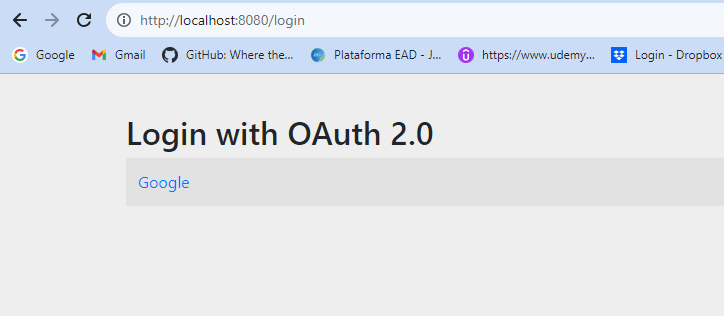

# Documentação do Projeto Spring Security

Este projeto Spring Security demonstra a configuração básica de autenticação e autorização em uma aplicação Spring Boot. Ele inclui exemplos de endpoints públicos, endpoints protegidos que requerem autenticação e como acessar informações do usuário autenticado.

## Classe `SpringSecurityApplication`

Esta classe é a classe principal da sua aplicação Spring Security. Ela inicia a aplicação Spring Boot e define alguns endpoints de exemplo para ilustrar a autenticação e autorização.

```java
@SpringBootApplication
public class SpringSecurityApplication {

    public static void main(String[] args) {
        SpringApplication.run(SpringSecurityApplication.class, args);
    }

}
```
## Classe `HttpController`

Esta classe define um controlador REST que lida com os endpoints da aplicação. Abaixo estão os principais pontos sobre esta classe:

```java
@RestController
class HttpController{
// http://localhost:8080/public
	@GetMapping("/public")
	String publicRoute(){
		return "<h1> Via pública, fique à vontade para dar uma olhada! </h1>";
	}
   
   // http://localhost:8080/cookie
	@GetMapping("/cookie")
	String cookieRoute(@AuthenticationPrincipal OidcUser cookie){
		
		return "<h1> Via privado, apenas pessoas autorizadas! </h1>\n" +
       "<h3> Principal: " + cookie + "</h3>\n" +
       "<h3> E-mail attribute: " + cookie.getAttribute("email") + "</h3>\n" +
       "<h3> Authorities: " + cookie.getAuthorities() + "</h3>\n" +
       "<h3> JWT: " + cookie.getIdToken().getTokenValue() + "</h3>\n";
	}

	// http://localhost:8080/jwt
	@GetMapping("/jwt")
	String jwtRoute(@AuthenticationPrincipal Jwt jwt) {

		return "<h1> Via privado, apenas pessoas autorizadas! </h1>\n" +
       "<h3> Principal: " + jwt.getClaims() + "</h3>\n" +
       "<h3> E-mail attribute: " + jwt.getClaim("mail") + "</h3>\n" +
       "<h3> JWT: " + jwt.getTokenValue() + "</h3>\n";
	}

	// Para acessar a página de login fornecido pelo Spring Security - http://localhost:8080/login
}
```

- **`@RestController`**: Esta anotação indica que esta classe é um controlador REST. Ela define três métodos para lidar com diferentes endpoints:

  - **`publicRoute()`:** Este método lida com a rota `/public` e retorna uma mensagem de boas-vindas pública.

  - **`cookieRoute()`:** Este método lida com a rota `/cookie` e espera um `OidcUser` autenticado. Ele retorna informações do usuário, incluindo o principal, atributos de e-mail, autoridades e um token JWT.

  - **`jwtRoute()`:** Este método lida com a rota `/jwt` e espera um `Jwt` autenticado. Ele retorna informações do usuário, incluindo o principal, atributo de e-mail e o valor do token JWT.

Esses métodos desempenham um papel importante no manuseio de requisições e fornecem diferentes funcionalidades com base nos endpoints acessados.

# Documentação da Classe `SecurityConfig`

A classe `SecurityConfig` é responsável por configurar a segurança da aplicação Spring. Ela utiliza a anotação `@Configuration` para indicar que é uma classe de configuração e `@EnableWebSecurity` para habilitar a segurança web.

## Método `securityFilterChain`

Este método é anotado com `@Bean` e retorna uma instância de `SecurityFilterChain`. Ele configura as regras de segurança para a aplicação. Vamos detalhar as configurações realizadas neste método:

- **`authorizeHttpRequests(authorizeConfig -> { ... })`**: Define as regras de autorização para as requisições HTTP. As configurações dentro deste bloco incluem:

  - `antMatchers("/public").permitAll()`: Permite acesso público à rota `/public`.
  
  - `antMatchers("/logout").permitAll()`: Permite acesso público à rota `/logout`.
  
  - `anyRequest().authenticated()`: Exige autenticação para todas as outras rotas.

- **`oauth2Login(oauth2LoginConfig -> { ... })`**: Configura o processo de autenticação OAuth2. A configuração inclui:

  - `defaultSuccessUrl("/cookie")`: Redireciona para `/cookie` após o login bem-sucedido.

- **`oauth2ResourceServer(OAuth2ResourceServerConfigurer::jwt)`**: Configura a aplicação para esperar tokens no formato JWT como prova de autenticação.

```java
@Configuration
@EnableWebSecurity
public class SecurityConfig{
    @Bean
    SecurityFilterChain securityFilterChain(HttpSecurity http) throws Exception {
        return http
                .authorizeHttpRequests(authorizeConfig -> {
                    // Rotas que não precisam de autenticação, são elas: public e logout
                    authorizeConfig.antMatchers("/public").permitAll();
                    authorizeConfig.antMatchers("/logout").permitAll();

                    // autorização só pode ser feito por alguém autenticado
                    authorizeConfig.anyRequest().authenticated();

                }).oauth2Login(oauth2LoginConfig -> {
                    oauth2LoginConfig
                            .defaultSuccessUrl("/cookie"); // Redireciona para /private após o login   
                                    
                }).oauth2ResourceServer(OAuth2ResourceServerConfigurer::jwt) // Para esperar token nesse formato
                .build();
    }
}
```
Essas configurações garantem que as rotas estejam protegidas e que os usuários sejam autenticados adequadamente. O `SecurityFilterChain` resultante é responsável por aplicar essas regras de segurança.

Lembre-se de que essas são configurações básicas e podem ser personalizadas conforme necessário para atender aos requisitos de segurança específicos da sua aplicação.

## Acessos da API

A API oferece as seguintes funcionalidades:

- [x] `GET /public`: Rota pública acessível a todos.
- [x] `GET /cookie`: Rota protegida que requer autenticação via Cookie.
- [x] `GET /jwt`: Rota protegida que requer autenticação via JWT.

## Endpoints

### `GET /public`

Esta rota é pública e pode ser acessada por qualquer pessoa sem autenticação. Ela retorna uma mensagem de boas-vindas.

**Exemplo de Requisição:**

```bash
GET http://localhost:8080/public
```

**Resposta Esperada:**

<p align="center">
  
</p>

## Redirecionamentos

### Página de Autenticação do Gmail

A API vai exigir autenticação via Gmail ao acessar `GET http://localhost:8080/cookie` ou `GET http://localhost:8080/`, a API redirecionará o usuário para a página de autenticação do Gmail, onde o usuário deve fazer login em sua conta do Gmail para acessar os endpoints protegidos. A API vai redirecionar o usuário para as seguinte página:

- [Página de Autenticação do Gmail](https://accounts.google.com/): Se o usuário não estiver autenticado - autenticação via Gmail é necessária.

### Página de Login

### `GET /login`

Quando um usuário acessa `GET http://localhost:8080/login` a API redirecionará o usuário para a página de login. O usuário deve fornecer suas credenciais para acessar os endpoints protegidos.

**Exemplo de Requisição:**

```bash
GET http://localhost:8080/login
```

**Resposta Esperada:**

<p align="center">
  
</p>


### `GET /cookie`
Esta rota requer autenticação via Cookie. É necessário estar autenticado para acessá-la. Ela retorna informações sobre o usuário, incluindo o principal, atributos de e-mail, autoridades e um token JWT.

**Exemplo de Requisição:**

```bash
GET http://localhost:8080/cookie
```

**Resposta Esperada:**

<p align="center">
  
</p>

### `GET /jwt`
Esta rota requer autenticação via JWT. É necessário estar autenticado para acessá-la. Ela retorna informações sobre o usuário, incluindo o principal, atributo de e-mail e o valor do token JWT.

**Exemplo de Requisição:**

```bash
GET http://localhost:8080/jwt
```

**Resposta Esperada:**

<p align="center">
  
</p>

## Documentação do Arquivo YAML de Configuração

Este documento descreve o arquivo YAML de configuração usado para configurar a segurança OAuth2 em um aplicativo Spring. Este arquivo especifica as configurações para autenticação com o provedor de identidade do Google.

### Detalhes da Configuração

Aqui estão os detalhes das configurações especificadas no arquivo YAML:

<p align="center">
  
</p>

### Entendendo as Propriedades

- **clientId**: Essa propriedade especifica o ID do cliente OAuth2 fornecido pelo Google. Ela identifica exclusivamente o aplicativo no Google como um cliente autorizado.

- **clientSecret**: O `clientSecret` é a chave secreta do cliente OAuth2 correspondente ao ID do cliente. Essa chave é usada para autenticação segura entre o aplicativo e o provedor de identidade.

### Configuração Adicional para o Servidor de Recursos JWT

Para configurar adequadamente o servidor de recursos JWT, é necessário especificar o URI do emissor do token JWT. No nosso caso, o token JWT é emitido pelo Google. O URI do emissor, chamado `issuer-uri`, é usado para verificar a validade dos tokens JWT recebidos pelo aplicativo.

Aqui está a configuração adicional:

```yaml
spring:
  security:
    oauth2:
      client:
        registration:
          google:
            clientId: [SUA-CHAVE-CLIENT-ID-AQUI]
            clientSecret: [SUA-CHAVE-SECRETA-AQUI]
      resourceserver:
        jwt:
          issuer-uri: https://accounts.google.com
```
Lembre-se de que a segurança e a privacidade são fundamentais. Mantenha o clientSecret em sigilo e não o compartilhe publicamente.

Para criar as credencias, consulte a [Google Clound Plataform](https://console.cloud.google.com).

## Autor
### **Documentação feita por:** `Daniel Penelva de Andrade`